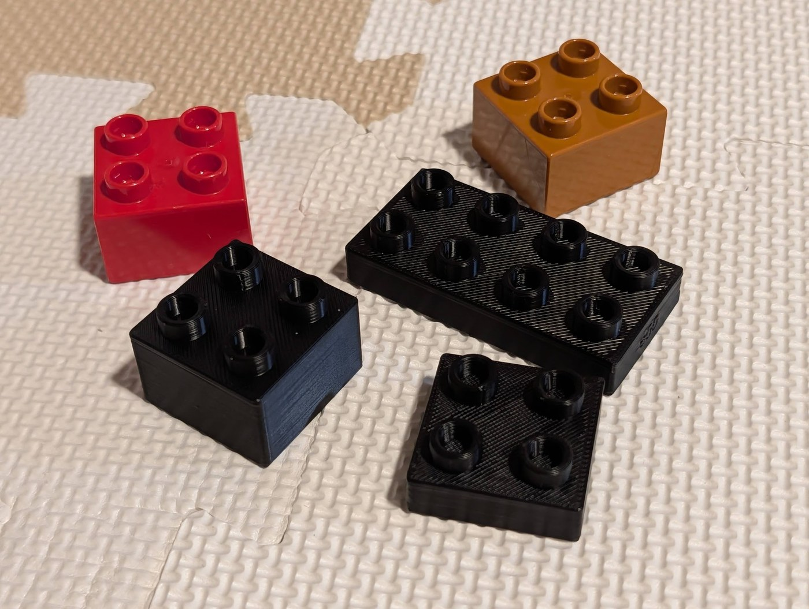
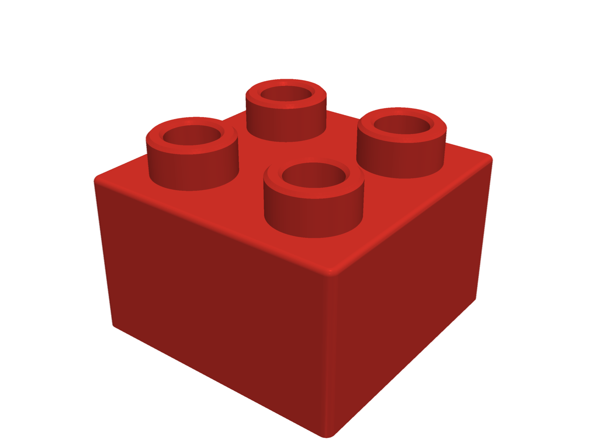
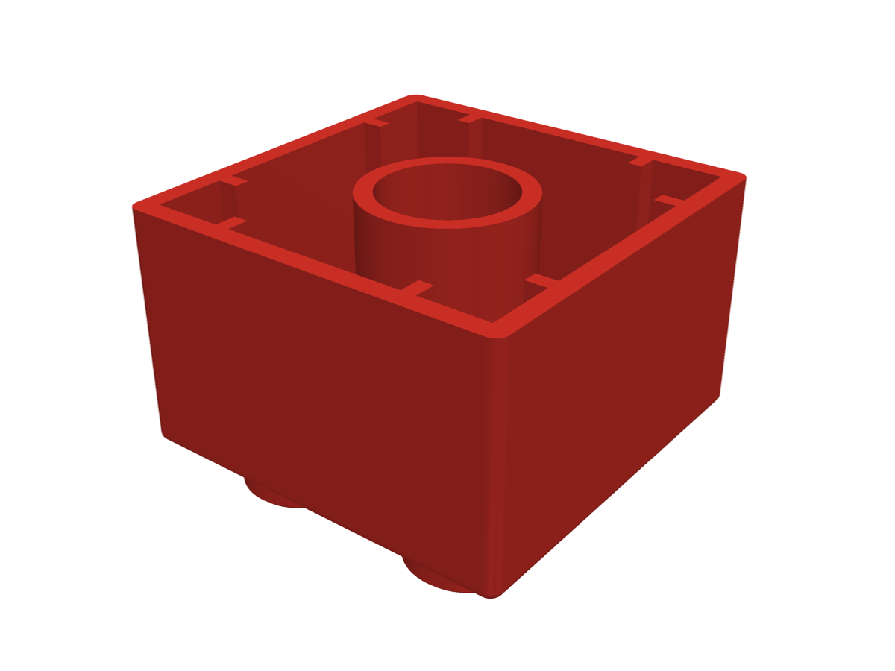
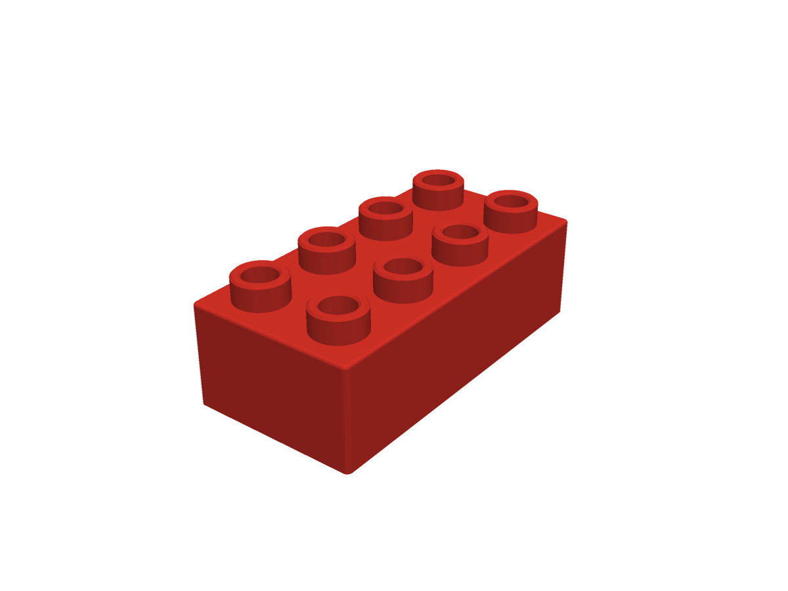

# duplo-compatible-brick

3D プリンターで刷れる DUPLO 互換ブロックの CadQuery スクリプトと STL です。実物の DUPLO をノギスで測った値から作り、Bambu Lab A2L + PETG で本物と上下ともちょうどよくはまるところまで合わせました。

CadQuery script and STL files for 3D-printable DUPLO-compatible bricks, modeled from caliper measurements of real DUPLO bricks and tuned to fit real bricks (top and bottom) on a Bambu Lab A2L with PETG.



本物の DUPLO（赤・茶）と、このデータを PETG で刷ったブロック（黒。左が 2x2、奥が高さ半分の 2x4、手前が高さ半分の 2x2）。

| 2x2 | 2x2（裏） | 2x4 |
|---|---|---|
|  |  |  |

## ファイル

| ファイル | 内容 | 外形（設計値） |
|---|---|---|
| `out/duplo_2x2.stl` / `.step` | 2x2 ブロック | 31.865 × 31.865 × 23.70 mm |
| `out/duplo_2x4.stl` | 2x4 ブロック | 31.865 × 64.042 × 23.70 mm |
| `out/fit_test_2x2_half_s0.55.stl` | 高さ半分の試し片（調整用） | 31.865 × 31.865 × 14.10 mm |
| `out/fit_test_2x4_half_s0.55.stl` | 高さ半分の試し片（調整用） | 31.865 × 64.042 × 14.10 mm |
| `duplo_brick.py` | 生成スクリプト（CadQuery） | — |

外形の設計値が実物（31.69）より大きいのは、PETG が XY で約 0.55% 縮む分を見込んでいるためです。A2L + PETG で刷ると 31.69 前後になる計算です（補正後の外形はまだノギスで測っていません）。

## 印刷設定（確認した条件）

- プリンター: Bambu Lab A2L（0.4 mm ノズル）
- 素材: PETG
- 工程: 0.20mm Standard / Textured PEI Plate / サポート無し
- 向き: ポッチを上、開いた裏面をベッドに置く
- 時間の目安: 2x2 が約 31 分・8 g、高さ半分の試し片が約 20 分・5 g

## 実物の DUPLO の実測値

| 箇所 | 値（mm） |
|---|---:|
| 2x2 の外形 | 31.67〜31.69 |
| 本体の高さ（ポッチ除く） | 19.17 |
| ポッチの外径 | 9.38 |
| ポッチの肉厚 | 1.79 |
| 外壁の厚み | 1.52 |
| 裏の筒の内径 | 10.69 |

モデルでは外壁を 1.6 mm（0.4 mm ノズル 4 周）、高さを 19.2 mm（0.2 mm 層 96 枚）にしています。

## 調整値

スクリプト冒頭の定数で変えられます。

| 定数 | 値 | 意味 |
|---|---:|---|
| `STUD_OFFSET` | 0.30 | ポッチの外径を太くする量（9.38 → 9.68） |
| `CLEARANCE` | −0.15 | 裏の筒とリブをきつくする量（マイナスできつく。筒の外径 13.25 → 13.55） |
| `XY_SHRINK` | 0.0055 | XY の縮み。外形とポッチの間隔だけを 1/(1 − 0.0055) 倍する。ポッチ・筒の径にはかけない |

決めた順番:

1. 裏をゆるめる方向（0.0 / 0.1 / 0.2）で試したら、3 つとも上下ゆるかった
2. きつくする方向（+0.15 / +0.30 / +0.45）で試し、下は +0.15、上は +0.30 がちょうどよかった
3. 組み合わせははまったが、外形が 31.51〜31.52 と小さかったので、縮みの補正を入れた
4. 補正後の高さ半分の 2x2・2x4 と、本体の高さの 2x2 を刷り、どれも本物と上下ともちょうどよくはまった

ほかの機種・素材では値が変わります。同じ値でも PLA で刷るときつめになりました。使う素材で、高さ半分の試し片を値違いで刷り、本物に上下とも挿して合わせ直してください。

## 生成

```bash
uv run --python 3.12 --with cadquery python duplo_brick.py
```

`out/` に上の STL・STEP を書き出します。別のサイズは `brick(nx, ny)`（例: `brick(2, 3)`）、試し片は `brick(2, 2, height=9.6, stud_offset=..., clearance=..., label="...")` で作れます。`label` は側面に彫る文字で、値違いの試し片を見分けるのに使います。

## ライセンス

MIT License。改変・商用利用も自由です。

LEGO / DUPLO は LEGO Group の商標です。このリポジトリは非公式で、LEGO Group とは関係ありません。
